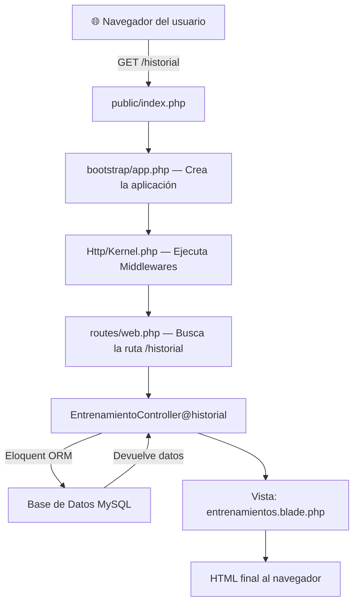
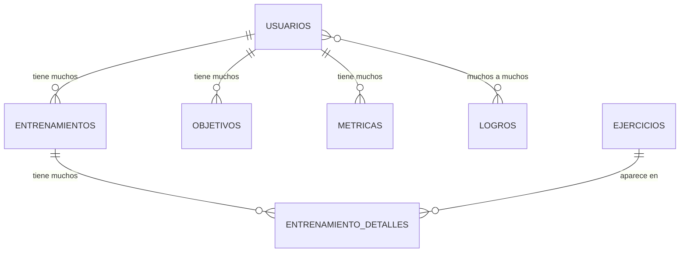

# Resumen Completo del Proyecto SinergyFit

## Cómo funciona Laravel por dentro

### El ciclo de vida de una petición

Cuando un usuario escribe `http://localhost:8000/historial` en su navegador, esto es lo que pasa internamente:



1. **`public/index.php`** → Es la puerta de entrada. Apache/Nginx redirige TODO aquí.
2. **`bootstrap/app.php`** → Crea la instancia de Laravel y registra los servicios.
3. **`Http/Kernel.php`** → Ejecuta los middlewares (seguridad, sesiones, CSRF...).
4. **`routes/web.php`** → Busca qué Controller y método debe ejecutar según la URL.
5. **Controller** → Ejecuta la lógica de negocio (consultas, cálculos, validaciones).
6. **Modelo (Eloquent)** → Traduce código PHP a consultas SQL para hablar con MySQL.
7. **Vista (Blade)** → Recibe los datos del Controller y genera el HTML final.

### Cómo Laravel habla con la Base de Datos (Eloquent ORM)

Laravel **nunca** escribe SQL directamente. Usa **Eloquent**, un ORM que convierte clases PHP en tablas:

| Clase PHP (Modelo) | Tabla MySQL | Qué guarda |
|---|---|---|
| `User` | `usuarios` | Datos de los usuarios registrados |
| `Entrenamiento` | `entrenamientos` | Cada sesión de entrenamiento |
| `EntrenamientoDetalle` | `entrenamiento_detalles` | Ejercicios concretos de cada sesión de fuerza |
| `Ejercicio` | `ejercicios` | Catálogo de ejercicios (Press Banca, etc.) |
| `Objetivo` | `objetivos` | Metas del usuario |
| `Metrica` | `metricas` | Peso, altura registrados |
| `Logro` | `logros` | Sistema de logros/gamificación |

**Ejemplo real:** Cuando haces `Entrenamiento::where('user_id', 1)->get()`, Laravel ejecuta internamente:
```sql
SELECT * FROM entrenamientos WHERE user_id = 1;
```

---

## Estructura del proyecto en árbol

```
fitnesstracker-laravel/
│
├── 📁 app/                          ← CEREBRO de la aplicación (lógica PHP)
│   ├── 📁 Console/
│   │   └── Kernel.php               ← Tareas programadas (cron jobs)
│   │
│   ├── 📁 Exceptions/
│   │   └── Handler.php              ← Manejo global de errores
│   │
│   ├── 📁 Http/                     ← Todo lo relacionado con peticiones web
│   │   ├── Kernel.php               ← Registra los middlewares
│   │   ├── 📁 Controllers/          ← Controladores (la lógica principal)
│   │   │   ├── Controller.php
│   │   │   ├── AuthController.php
│   │   │   ├── EntrenamientoController.php
│   │   │   ├── MetricaController.php
│   │   │   ├── ObjetivoController.php
│   │   │   └── PerfilController.php
│   │   └── 📁 Middleware/           ← Filtros de seguridad
│   │       ├── Authenticate.php
│   │       ├── EncryptCookies.php
│   │       ├── VerifyCsrfToken.php
│   │       └── ... (otros)
│   │
│   ├── 📁 Models/                   ← Modelos (representan tablas de la BD)
│   │   ├── User.php
│   │   ├── Entrenamiento.php
│   │   ├── EntrenamientoDetalle.php
│   │   ├── Ejercicio.php
│   │   ├── Objetivo.php
│   │   ├── Metrica.php
│   │   └── Logro.php
│   │
│   ├── 📁 Notifications/
│   │   └── RecordatorioEntrenamiento.php
│   │
│   └── 📁 Providers/               ← Proveedores de servicios
│       ├── AppServiceProvider.php
│       ├── AuthServiceProvider.php
│       ├── RouteServiceProvider.php
│       └── ... (otros)
│
├── 📁 bootstrap/                    ← Arranque de Laravel
│   └── app.php
│
├── 📁 config/                       ← Configuración de la app
│   ├── app.php
│   ├── auth.php
│   ├── database.php
│   ├── session.php
│   └── ... (otros)
│
├── 📁 database/                     ← Todo sobre la base de datos
│   ├── 📁 factories/               ← Fábricas para datos de prueba
│   │   ├── UserFactory.php
│   │   ├── EntrenamientoFactory.php
│   │   └── ObjetivoFactory.php
│   ├── 📁 migrations/              ← Migraciones (crean/modifican tablas)
│   │   ├── create_users_table.php
│   │   ├── create_entrenamientos_table.php
│   │   ├── create_objetivos_table.php
│   │   ├── create_ejercicios_table.php
│   │   ├── create_entrenamiento_detalles_table.php
│   │   ├── create_metricas_table.php
│   │   ├── create_logros_table.php
│   │   ├── create_logro_user_table.php
│   │   └── ... (otras modificaciones)
│   └── 📁 seeders/                 ← Datos iniciales de la BD
│       ├── DatabaseSeeder.php
│       └── LogroSeeder.php
│
├── 📁 public/                       ← Archivos accesibles desde el navegador
│   ├── index.php
│   ├── .htaccess
│   └── 📁 images/
│
├── 📁 resources/                    ← Recursos frontend
│   ├── 📁 css/
│   │   └── app.css
│   ├── 📁 js/
│   │   ├── app.js
│   │   └── bootstrap.js
│   └── 📁 views/                   ← Vistas Blade (HTML)
│       ├── 📁 layouts/
│       │   └── app.blade.php
│       ├── 📁 partials/
│       │   ├── navbar.blade.php
│       │   ├── sidebar.blade.php
│       │   └── actividad.blade.php
│       ├── 📁 auth/
│       │   └── register.blade.php
│       ├── 📁 objetivos/
│       │   └── index.blade.php
│       ├── login.blade.php
│       ├── inicio.blade.php
│       ├── registro.blade.php
│       ├── editar.blade.php
│       ├── entrenamientos.blade.php
│       ├── estadisticas.blade.php
│       ├── calendario.blade.php
│       └── perfil.blade.php
│
├── 📁 routes/                       ← Definición de URLs
│   ├── web.php
│   └── api.php
│
├── 📁 storage/                      ← Archivos generados (logs, caché, fotos)
│   ├── 📁 app/
│   ├── 📁 framework/
│   └── 📁 logs/
│
├── .env                             ← Variables de entorno
├── composer.json                    ← Dependencias PHP
├── Dockerfile                       ← Imagen Docker
├── docker-compose.yml               ← Orquestación Docker
└── vite.config.js                   ← Compilador de assets frontend
```

---

## Explicación detallada por carpetas y archivos

---

### 📁 `public/` — Punto de entrada público

Esta es la **única carpeta accesible directamente** desde el navegador. Apache/Nginx apunta aquí.

| Archivo | Función |
|---|---|
| **`index.php`** | **Puerta de entrada a toda la app.** Cada petición HTTP pasa por aquí. Carga el autoloader de Composer, crea la instancia de Laravel desde `bootstrap/app.php`, y lanza el Kernel HTTP para procesar la petición. |
| **`.htaccess`** | Configuración de Apache para redirigir todas las URLs a `index.php` (URL amigables). |
| **`images/`** | Imágenes estáticas: logo, fondo de pantalla, etc. |

---

### 📁 `bootstrap/` — Arranque de la aplicación

| Archivo | Función |
|---|---|
| **`app.php`** | Crea la instancia principal de Laravel (`Application`). Registra los 3 "singletons" fundamentales: el Kernel HTTP, el Kernel de Consola y el Handler de Excepciones. Es el **pegamento** que une todos los componentes. |

---

### 📁 `config/` — Configuración centralizada

Todos los archivos de configuración de Laravel. Cada uno devuelve un array PHP y lee sus valores del `.env`.

| Archivo | Función |
|---|---|
| **`app.php`** | Nombre de la app, zona horaria, idioma, providers registrados. |
| **`auth.php`** | Configura el sistema de autenticación. Define que usamos el modelo `User` con la tabla `usuarios` y sesiones web. |
| **`database.php`** | Conexiones a base de datos. Lee `DB_HOST`, `DB_DATABASE`, etc. del `.env`. Nuestro driver es MySQL. |
| **`session.php`** | Cómo se almacenan las sesiones de usuario (en archivos por defecto). |
| Otros (`cache`, `mail`, `logging`...) | Configuración de caché, correo, logs, etc. |

---

### 📁 `routes/` — Mapa de URLs de la aplicación

Define **qué ocurre cuando el usuario visita cada URL**.

#### `web.php` — Rutas principales

| Ruta | Método | Controller → Función | Qué hace |
|---|---|---|---|
| `/login` | GET | `AuthController@showLoginForm` | Muestra formulario de login |
| `/login` | POST | `AuthController@login` | Procesa el login |
| `/registro-usuario` | GET/POST | `AuthController@showRegisterForm / register` | Registro de cuenta |
| `/logout` | POST | `AuthController@logout` | Cierra sesión |
| `/` | GET | `EntrenamientoController@index` | Dashboard/Inicio |
| `/registro` | GET | Vista directa | Formulario de registrar entrenamiento |
| `/entrenamientos` | POST | `EntrenamientoController@store` | Guarda un entrenamiento nuevo |
| `/entrenamientos/{id}/edit` | GET | `EntrenamientoController@edit` | Formulario de edición |
| `/entrenamientos/{id}` | PUT | `EntrenamientoController@update` | Guarda cambios de edición |
| `/entrenamientos/{id}` | DELETE | `EntrenamientoController@destroy` | Elimina entrenamiento |
| `/historial` | GET | `EntrenamientoController@historial` | Lista paginada del historial |
| `/historial/exportar` | GET | `EntrenamientoController@exportCSV` | Descarga CSV |
| `/estadisticas` | GET | `MetricaController@index` | Panel de estadísticas |
| `/objetivos` | CRUD | `ObjetivoController` | Gestión de metas |
| `/perfil` | GET/POST | `PerfilController@index / update` | Ver y editar perfil |
| `/calendario` | GET | `EntrenamientoController@calendario` | Vista del calendario |
| `/api/calendario/eventos` | GET | `EntrenamientoController@eventosAPI` | JSON para FullCalendar |
| `/api/metricas/dashboard` | GET | `MetricaController@dashboardAPI` | JSON para gráficas |
| `/api/metricas/tipos` | GET | `MetricaController@tiposAPI` | JSON para gráfica de tipos |

> Las rutas protegidas con `middleware('auth')` solo son accesibles si el usuario ha iniciado sesión.

#### `api.php` — Rutas API
Contiene una ruta por defecto de Sanctum. No se usa activamente en el proyecto.

---

### 📁 `app/Http/Controllers/` — Controladores (lógica de negocio)

Los controladores son el **corazón** del proyecto. Reciben las peticiones, ejecutan la lógica y devuelven vistas o datos JSON.

#### `AuthController.php` — Autenticación
- **`showLoginForm()`** → Devuelve la vista `login.blade.php`.
- **`login()`** → Valida email/contraseña, usa `Auth::attempt()` para autenticar contra la BD.
- **`showRegisterForm()`** → Devuelve la vista de registro.
- **`register()`** → Crea un nuevo `User` con contraseña hasheada (`bcrypt`), hace auto-login.
- **`logout()`** → Cierra la sesión, invalida el token CSRF.

#### `EntrenamientoController.php` — Entrenamientos (el más extenso)
- **`index()`** → Dashboard: obtiene las 5 últimas actividades del usuario.
- **`historial()`** → Lista paginada (20/página) con filtro por tipo (Fuerza/Carrera/Caminata).
- **`exportCSV()`** → Genera un archivo CSV descargable con todo el historial.
- **`store()`** → Guarda un entrenamiento nuevo. Lógica compleja:
  - Calcula calorías según tipo (Carrera=11kcal/min, Caminata=4.5, Fuerza=6.5).
  - Si es Fuerza: guarda los detalles de cada ejercicio (series, reps, carga).
  - Gestiona rachas (streaks) de días consecutivos.
  - Gamificación: comprueba si se desbloquea algún logro.
- **`edit()`** → Muestra el formulario de edición con los datos precargados.
- **`update()`** → Guarda los cambios editados. Recalcula calorías, actualiza detalles de fuerza.
- **`destroy()`** → Elimina un entrenamiento (solo el dueño puede hacerlo).
- **`calendario()`** → Devuelve la vista del calendario.
- **`eventosAPI()`** → Devuelve JSON con colores por tipo para que FullCalendar los pinte.

#### `MetricaController.php` — Estadísticas y gráficas
- **`index()`** → Calcula: totales globales, totales del periodo, tendencia vs periodo anterior, mejor marca de carga, progreso de objetivos. Soporta filtro semana/mes/año.
- **`dashboardAPI()`** → Devuelve JSON para la gráfica de líneas (minutos entrenados por día/mes).
- **`tiposAPI()`** → Devuelve JSON para la gráfica de distribución de tipos de entrenamiento.

#### `ObjetivoController.php` — Metas/Objetivos
- **`index()`** → Lista objetivos calculando el progreso real de cada uno (volumen, días entrenados, peso corporal). Auto-completa si alcanza la meta.
- **`store()`** → Crea un objetivo nuevo con fecha inicio y límite.
- **`update()`** → Cambia el estado de un objetivo (en_progreso ↔ completado).
- **`destroy()`** → Elimina un objetivo.

#### `PerfilController.php` — Perfil de usuario
- **`index()`** → Muestra los datos del usuario autenticado.
- **`update()`** → Actualiza nombre, apellidos, biografía, peso, altura, edad, género, foto de perfil. Calcula automáticamente el porcentaje de grasa corporal mediante fórmula de IMC.

---

### 📁 `app/Models/` — Modelos Eloquent

Cada modelo representa una tabla de la base de datos y define sus relaciones.

| Modelo | Tabla | Campos clave | Relaciones |
|---|---|---|---|
| **`User`** | `usuarios` | name, email, password, peso, altura, edad, genero, grasa, foto, nivel_actividad, racha_actual, mejor_racha | hasMany → Entrenamiento, Objetivo, Metrica. belongsToMany → Logro. Método `calcularRacha()` |
| **`Entrenamiento`** | `entrenamientos` | user_id, fecha, tipo, duracion_minutos, calorias_estimadas, notas | belongsTo → User. hasMany → EntrenamientoDetalle. belongsToMany → Ejercicio |
| **`EntrenamientoDetalle`** | `entrenamiento_detalles` | entrenamiento_id, ejercicio_id, grupo_muscular, series, repeticiones, carga_kg | belongsTo → Entrenamiento, Ejercicio |
| **`Ejercicio`** | `ejercicios` | nombre, grupo_muscular | belongsToMany → Entrenamiento |
| **`Objetivo`** | `objetivos` | user_id, tipo_objetivo, valor_objetivo, progreso, fecha_inicio, fecha_limite, estado | belongsTo → User. Accessor `getEstadoRealAttribute()` para detectar objetivos caducados |
| **`Metrica`** | `metricas` | user_id, peso, altura, fecha_registro | belongsTo → User |
| **`Logro`** | `logros` | nombre, descripcion, icono, criterio, puntos | belongsToMany → User. Constantes para los 5 tipos de logro |

#### Diagrama de relaciones



---

### 📁 `app/Http/Middleware/` — Filtros de seguridad

Los middlewares se ejecutan **antes** de que la petición llegue al Controller.

| Middleware | Función |
|---|---|
| **`Authenticate`** | Si el usuario no ha iniciado sesión, lo redirige a `/login`. |
| **`VerifyCsrfToken`** | Protege contra ataques CSRF verificando un token secreto en cada formulario POST. |
| **`EncryptCookies`** | Cifra las cookies del navegador. |
| **`RedirectIfAuthenticated`** | Si ya estás logueado e intentas acceder a `/login`, te manda al inicio. |
| **`TrimStrings`** | Limpia espacios en blanco de los inputs del formulario. |

---

### 📁 `app/Http/Kernel.php` — Registro de Middlewares

Define 3 niveles de middleware:
- **Global**: Se ejecutan en TODA petición (CORS, tamaño de POST, etc.).
- **Grupos** (`web`, `api`): Se aplican según el tipo de ruta.
- **Aliases** (`auth`, `guest`, `throttle`): Se pueden asignar individualmente a rutas.

---

### 📁 `resources/views/` — Vistas Blade (Frontend)

Blade es el motor de plantillas de Laravel. Usa `@extends`, `@yield`, `@section`, `@include` para componer páginas.

#### `layouts/app.blade.php` — Layout maestro
Es la **plantilla base** que envuelve TODAS las páginas. Contiene:
- `<head>`: Bootstrap 5 CSS, Font Awesome, variables CSS custom (`--primary-color: #2A5199`).
- Inclusión de `navbar.blade.php` y `sidebar.blade.php`.
- `@yield('contenido')`: aquí se inyecta el contenido de cada página.
- Scripts: Bootstrap JS, confetti (para celebrar logros).

#### `partials/navbar.blade.php` — Barra de navegación superior
- Logo de SinergyFit con degradado.
- Botón hamburguesa para abrir el sidebar.
- Avatar del usuario (foto o icono fallback) + nombre.

#### `partials/sidebar.blade.php` — Menú lateral deslizante
- Links a: Inicio, Registrar, Entrenamientos, Estadísticas, Metas, Calendario, Perfil.
- Botón de Cerrar Sesión.
- Resalta la página activa con la clase `active`.

#### `partials/actividad.blade.php` — Tarjeta de actividad reutilizable
Componente visual para mostrar una actividad en el dashboard y el historial.

#### Páginas principales

| Vista | URL | Función |
|---|---|---|
| **`login.blade.php`** | `/login` | Formulario de inicio de sesión |
| **`auth/register.blade.php`** | `/registro-usuario` | Formulario de crear cuenta |
| **`inicio.blade.php`** | `/` | Dashboard: últimas actividades, racha, logros desbloqueados, confetti al desbloquear logro |
| **`registro.blade.php`** | `/registro` | Formulario para registrar un entrenamiento. Tabs para Fuerza/Carrera/Caminata. En Fuerza: selector dinámico de ejercicios por grupo muscular |
| **`editar.blade.php`** | `/entrenamientos/{id}/edit` | Formulario de edición de entrenamiento con datos precargados |
| **`entrenamientos.blade.php`** | `/historial` | Lista paginada del historial con filtro por tipo y botón de exportar CSV |
| **`estadisticas.blade.php`** | `/estadisticas` | Panel con gráficas Chart.js (líneas y donut), KPIs, tendencias, progreso de objetivos |
| **`calendario.blade.php`** | `/calendario` | Calendario interactivo FullCalendar con eventos coloreados por tipo |
| **`objetivos/index.blade.php`** | `/objetivos` | Lista de metas con barras de progreso, formulario para crear nuevas |
| **`perfil.blade.php`** | `/perfil` | Edición de perfil: datos personales, foto, métricas corporales |

---

### 📁 `database/migrations/` — Migraciones

Las migraciones son como el **control de versiones de la base de datos**. Cada archivo crea o modifica una tabla. Se ejecutan con `php artisan migrate`.

| Migración | Qué hace |
|---|---|
| `create_users_table` | Crea la tabla `usuarios` (nombre, email, password) |
| `create_entrenamientos_table` | Crea la tabla `entrenamientos` (fecha, tipo, duración, notas) |
| `create_objetivos_table` | Crea la tabla `objetivos` (tipo, valor, progreso, fechas, estado) |
| `create_ejercicios_table` | Crea la tabla `ejercicios` (nombre, grupo muscular) |
| `create_entrenamiento_detalles_table` | Tabla pivote: ejercicios dentro de un entrenamiento (series, reps, carga) |
| `add_profile_fields_to_users` | Añade apellidos, biografía a usuarios |
| `add_body_metrics_to_users` | Añade peso, altura, edad, género, grasa |
| `add_foto_to_users` | Añade campo de foto de perfil |
| `add_actividad_to_users` | Añade nivel de actividad |
| `create_metricas_table` | Crea tabla de métricas corporales |
| `create_logros_table` | Crea tabla de logros |
| `create_logro_user_table` | Tabla pivote muchos-a-muchos entre usuarios y logros |
| `add_racha_fields_to_usuarios` | Añade racha_actual, mejor_racha, ultima_actividad_fecha |
| `add_calorias_estimadas` | Añade campo de calorías estimadas a entrenamientos |

---

### 📁 `database/seeders/` — Datos iniciales

| Seeder | Función |
|---|---|
| **`DatabaseSeeder.php`** | Crea un usuario de prueba, métricas, ejercicios, entrenamientos de ejemplo y objetivos. |
| **`LogroSeeder.php`** | Inserta los 5 logros del sistema de gamificación: Primer Paso, Constancia Pura, Levantador NATO, Maratonista, Leyenda del Sudor. |

---

### 📁 `app/Notifications/`

| Archivo | Función |
|---|---|
| **`RecordatorioEntrenamiento.php`** | Notificación por email. Se enviaría a usuarios que llevan días sin entrenar. Usa el sistema de correo de Laravel. |

---

### 📁 `app/Providers/` — Proveedores de Servicios

| Provider | Función |
|---|---|
| **`AppServiceProvider`** | Configuración general de la app al arrancar. |
| **`AuthServiceProvider`** | Políticas de autorización. |
| **`RouteServiceProvider`** | Configura cómo Laravel carga los archivos de rutas (`web.php`, `api.php`). |
| **`EventServiceProvider`** | Registro de eventos y listeners. |

---

### Archivos raíz del proyecto

| Archivo | Función |
|---|---|
| **`.env`** | Variables de entorno: nombre de la BD, credenciales, clave de la app. **Nunca se sube a Git.** |
| **`composer.json`** | Lista de dependencias PHP (Laravel, Sanctum, etc.). Equivalente al `package.json` de Node. |
| **`Dockerfile`** | Receta para construir la imagen Docker: PHP 8.2 + Apache, instala extensiones, copia código, ejecuta `composer install`. |
| **`docker-compose.yml`** | Orquesta 3 contenedores: app (Laravel), db (MySQL 8.0), phpmyadmin. |
| **`artisan`** | CLI de Laravel. Se usa con `php artisan migrate`, `php artisan tinker`, etc. |
| **`vite.config.js`** | Configuración de Vite para compilar CSS/JS. |

---

### 📁 `storage/` — Almacenamiento interno

| Subcarpeta | Función |
|---|---|
| **`app/`** | Archivos subidos (fotos de perfil en `app/public/avatars`). |
| **`framework/`** | Caché, sesiones, vistas compiladas por Blade. |
| **`logs/`** | Archivo `laravel.log` con errores y debug. |
